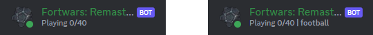

# GameStatus-Bot

    
    
    

 
A simple and efficient Discord bot that fetches real-time player counts and map information for your favorite game servers using the SourceQuery and REST APIs. Keep your community informed about server status and engage with your players seamlessly.
  

    

